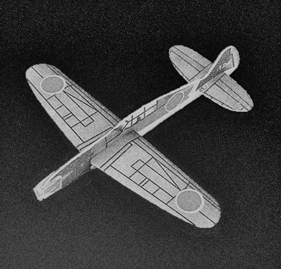
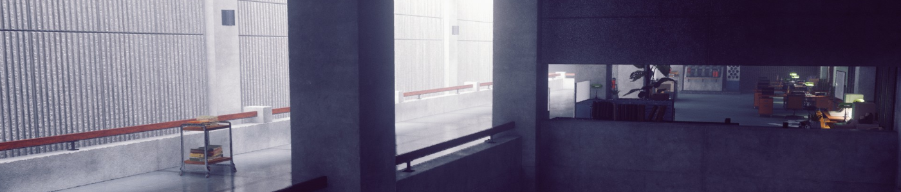
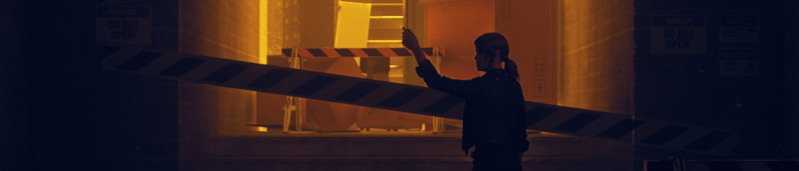
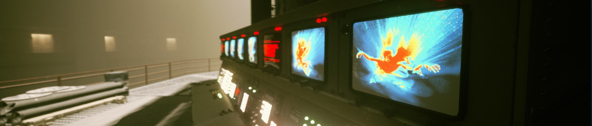
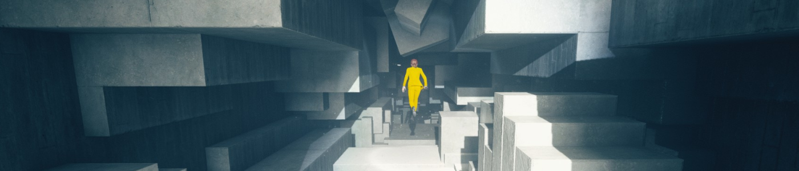
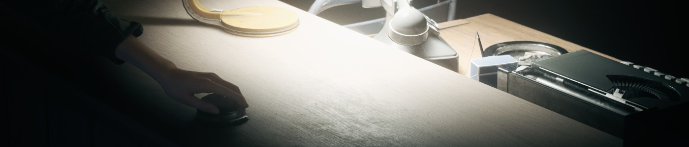
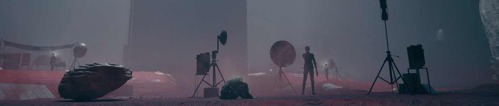
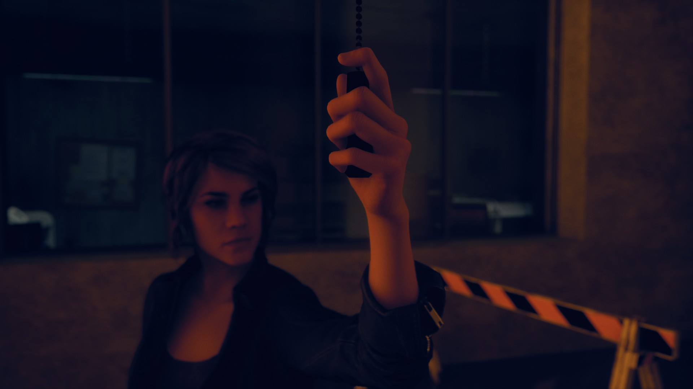
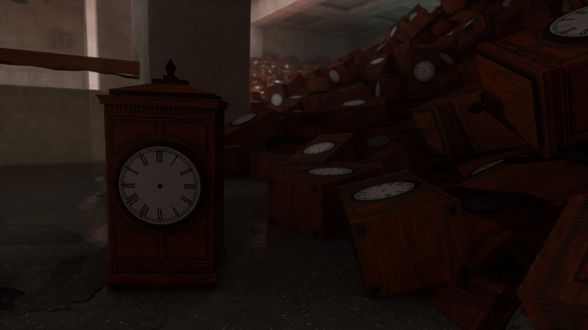
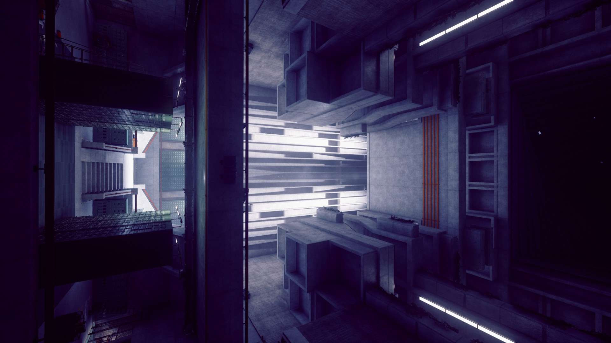

> ## Planeur en polystyrène (AI72-KE)
>
> 
>
> *PROCÉDURE DE CONFINEMENT :*
>
> L'objet doit être stocké dans le coffret en pierre noire prévu à cet effet, surtout lors de son transport.
>
> *DESCRIPTION/EFFET D'ALTÉRATION :*
>
> L'objet est un planeur en polystyrène vert pomme de 19 centimètres de long pour 18 centimètres de large. Il est décoré de motifs rouges et jaunes. Des études sur le matériau le constituant indiquent que, bien qu'ayant la densité du polystyrène, sa résistance est bien supérieure, ce qui laisserait penser que l'objet est en réalité constitué de █████████.  
> Une fois lancé dans les airs, le planeur peut produire une onde de choc semblable à celle d'un avion supersonique. Ce phénomène se produit pendant le vol de l'objet et à des vitesses bien inférieurs à celles normalement nécessaires. L'onde de choc produite peut endommager tout ce qui se trouve dans un rayon de ██ mètres autour de l'objet.  
> Un enregistrement du phénomène révèle que ███████████████████████ ███████████████ et on peut distinguer ███████████████████████████ ████████████████████████████ ████████████████████████ ████████ sonore.
>
> *ANTÉCÉDENTS :*
>
> L'objet a été récupéré par le Bureau le ██/██/1995 à ██████ suite à des plaintes de nuisances. L'objet, alors détenu par un enfant, avait causé la casse des fenêtres de sa maison ainsi que de celles de plusieurs de ses voisins.

Amateurs de **paranormal**, d'organisations gouvernementales secrètes et de documents classifiés, ce jeu est fait pour vous ! Parlons donc de **Control**, le dernier jeu de *Remedy* sorti à ce jour. Il est temps de prendre votre Arme de Service, directrice, et de repousser le mal qui s'est insinué entre les murs du Bureau.

# Un premier jour de travail mouvementé

L'histoire débute par notre protagoniste, **Jesse Faden**, entrant dans le **Bureau Fédéral de Contrôle**. Le BFC est une entité d'État dont le rôle est d'enquêter sur des phénomènes paranormaux et de les maîtriser, tout cela sans que le grand public n'en sache rien. 
Si Jesse est là, ce n'est pas par hasard : il y a de cela des années, après un **évènement d'altération du monde** s'étant déroulé dans sa ville natale, des agents du BFC ont débarqué et **kidnappé son frère**.
L'incident n'a pas été sans impact sur la jeune fille : en plus de traumatismes psychiques, une entité d'un autre monde s'est glissée dans son esprit, lui donnant quelques capacités de résistance au paranormal.
Avec l'aide de cette entité appelée **Polaris**, et après des années de recherches, elle a enfin réussi à retrouver la piste de cette agence secrète et est bien décidée à récupérer ce qu'ils lui ont enlevé.

Cependant, il n'y a ni hôtesse ni garde pour l'accueillir, le bâtiment est vide. Elle ne croise qu'un **agent d'entretien** qui lui baragouine quelques indications vers le bureau du directeur. 
**Quelque chose cloche**, et cela lui apparaît encore plus évident lorsqu'elle découvre le corps inanimé du directeur, qui semble s'être donné la mort d'une balle dans la tête.
Ce que notre héroïne ne sait pas, c'est qu'en posant sa main sur l'**Arme de Service** qui repose à côté du cadavre, elle venait de proposer sa candidature en tant que nouvelle directrice auprès d'une entité extra-dimensionnelle appelée **Le Conseil**.

Celui-ci a justement besoin de quelqu'un pour gérer l'actuelle crise du Bureau : une entité maléfique, nommée **le Hiss**, a débarqué d'une autre dimension et est en train de prendre le contrôle du personnel du BFC. La menace est actuellement confinée dans l'**Ancienne Maison**, un bâtiment aux murs mouvants servant de locaux au bureau, mais qui sait ce qui pourrait arriver s'il venait à s'échapper ?
En échange de son aide pour repousser le Hiss, Jesse pourra utiliser son statut de **Directrice** pour obtenir des informations sur son frère ainsi que sur les évènements paranormaux dont elle fut témoin dans sa jeunesse.

Il faudra se montrer prudent : l'attaque du Hiss a aussi libéré des **Objets altérés** normalement confinés dans l'Ancienne Maison. Ces objets, d'apparence anodine (un frigo, un canard en plastique, ou encore un téléviseur) peuvent se révéler dangereux en liberté. Certains de ces objets, appelés **Objets de Pouvoir**, peuvent être contrôlés pour acquérir de nouvelles capacités, comme de la télékinésie ou le contrôle mental.

Jesse croisera aussi des personnes ayant échappé au contrôle de l'ennemi. Elle pourra compter sur le soutien entre autres d'**Emily Pope**, successeur à l'excentrique Docteur Darling à la tête du département des recherches, ainsi que d'**Helen Marshall**, ancienne agent de la CIA à la tête des opérations du Bureau. Elle retrouvera aussi **Ahti**, le mystérieux concierge qui l'a accueilli et qui connaît l'Ancienne Maison comme sa poche. 

# À la lisière d'autres mondes

Entités abstraites, dimensions parallèles, évènements paranormaux... Comme vous avez pu le constater, le thème narratif du jeu puise dans le **fantastique**, le **paranormal**, avec une touche de science-fiction. Ce sont des thèmes que **Remedy**, les développeurs du jeu, ont déjà explorés auparavant (*Alan Wake, Quantum Break...*), auquel s'ajoute une couche bureaucratique.

Cela passe notamment par tous ces **laboratoires d'analyses** sur la chance, les rites ou le plan astral, et tous ces rapports et autres **documents caviardés** sur les Objets Altérés et les interventions du Bureau sur le terrain, qui ne sont pas sans rappeler le site de la [fondation SCP](http://fondationscp.wikidot.com/ "Ne leur dites pas que c'est moi qui vous envoie, ou *ils* viendront me chercher !").
Ce fut pour moi un plaisir de parcourir ces papiers pour découvrir les propriétés incongrues de ces babioles d'apparence ordinaire. Cela va du **ventilateur** qui étouffe les personnes à proximité au **miroir** permettant de se rendre dans une autre dimension. Si certains de ces objets n'existent qu'en écrit, d'autres font l'objet de **missions secondaires** et peuvent se cacher au bout d'un passage dérobé, alors ouvrez l'œil !

Ce jeu est aussi l'occasion pour le studio finlandais de faire des références à ses précédents titres, tout particulièrement à **Alan Wake** au vu du nombre de documents traitant des évènements de Bright Falls. Plus encore, avec sa seconde extension **AWE**, l'histoire de *Control* se mêle avec celle de l'ancien titre de Remedy et pose les bases d'un univers connecté, tout en annonçant le retour de l'écrivain maudit.

# Voyage dans un dédale bureaucratique

Un autre point fort du titre est son terrain de jeu, l'**Ancienne Maison**. Malgré son architecture de béton brut et bien d'équerre, elle ne manque pas de lieux marquants. L'immense générateur au sous-sol, la hotline, la mine de pierre noire, l'hôtel et casino Oceanview, la lisière des horloges, les énormes portes coupe-feu... Les environnements savent se renouveler.

Ne vous fiez pas à la froideur de ses murs en béton, il s'agit aussi d'un **Lieu de Pouvoir** en constante évolution. Les pièces bougent, de nouvelles zones apparaissent lorsque d'autres se volatilisent, et la corruption du Hiss **déstructure des départements entiers du BFC**. Arriver dans une zone contrôlée par l'ennemi et baignant dans la lumière rouge, puis de voir les murs reprendre leur place au moment d'en reprendre le contrôle, je trouve ça très esthétique. Le plus impressionnant est le passage dans le **labyrinthe du cendrier**, mais je vous en garde la surprise...

Enfin, tous ces lieux s'organisent selon un formalisme de level design que j'adore : le **Metroïd-like**. Cela passe par des zones très connectées entre elles, avec des passages qui se révèlent au fur et à mesure que l'on progresse dans le jeu.
J'apprécie particulièrement **m'approprier les lieux** à force d'y faire des allers-retours et découvrir des couloirs secrets menant à une zone optionnelle ou créant juste un raccourci. Ce n'est peut-être pas le meilleur représentant du genre, mais c'est suffisant pour inciter à reparcourir le dédale de l'Ancienne Maison. 

# L'ennemi invisible

Mais n'espérez pas y flâner insouciamment, car le Hiss vous enverra des hordes d'ennemis pour vous arrêter. Ces assauts pourront être repoussés par Jesse grâce à l'**Arme de service**, un pistolet pouvant **changer de forme**, et donc de type de tir. Elle est capable de passer d'une mitraillette à un fusil à pompe en un clin d'œil. Ne vous inquiétez pas pour les munitions, car l'Arme se les régénère lorsqu'elle n'est pas utilisée.
En attendant, vous pouvez utiliser vos **capacités**, données par le Conseil au travers des Objets de pouvoir. À vous de découvrir les joies de **balancer des meubles** sur vos ennemis ou de vous **créer un bouclier de gravats**. Notez que ces capacités consomment une **barre d'endurance**, qui elle aussi se recharge lorsque vous ne l'utilisez pas. Il vous faudra donc gérer ces temps de recharge en **alternant intelligemment entre votre arme et vos pouvoirs**.

En face de vous, l'opposition sera tout d'abord constituée de **la milice du Bureau** sous le contrôle du Hiss et à l'armement diversifié. Cela reste plutôt classique dans un TPS, mais ils seront très vite rejoints par **des ennemis aux capacités paranormales**, capable notamment de voler, d'exploser ou de se rendre invisibles. Chacun a ses forces et ses faiblesses, il vous faudra rester sur vos gardes lors des assauts pour y offrir la réponse adéquate. Par exemple, les boucliers d'énergie sont plus sensibles aux pouvoirs qu'aux balles.

Un autre conseil : le jeu vous demande de rester **mobile**, alors évitez de camper sur une position et de laisser les ennemis approcher, sachant que vous pouvez rapidement vous faire submerger. D'autant plus que votre **santé ne remonte pas toute seule**, elle est lâchée par les ennemis auxquels vous faites des dégâts, mais il vous faudra aller la ramasser, ce qui souvent signifie aller au-devant du danger. Tout cela donne des **affrontements dynamiques** mélangeant armes de tir et super pouvoirs.

Enfin, votre arsenal pourra être **amélioré** par des modificateurs et des points de compétences. Cependant, à quelques exceptions près, je n'ai pas vu d'évolutions flagrantes apportées par ces améliorations, à part d'être constamment en train de faire du ménage dans **ce menu de mods avec trop peu de place**.

# En rouge et gris

**J'aime beaucoup d'esthétique du jeu.** Outre les grandes structures bétonnées, la manière dont l'antagoniste se manifeste en ces lieux est remarquable : les corps flottants et psalmodiant, la déstructuration des murs, ou tout simplement **le rouge vif indiquant la présence du Hiss**. Il y a aussi les vidéos en prises de vues réelles, signature du studio, qui reviennent ici sous forme de **petites présentations du docteur Darling** sur l'avancement de ses recherches, et tordantes de rire. Enfin, une fonctionnalité visuelle dont je n'ai pas pu profiter, car mon PC n'a pas de carte graphique appropriée, mais *Control* est l'un des premiers jeux à exploiter le **ray tracing** pour les reflets sur certaines surfaces.

Tant qu'on est à parler de **technique**, si j'ai eu des retours que certaines versions consoles avaient des difficultés à la sortie du jeu, la version PC sur laquelle j'ai joué il y a quelques mois m'a paru **solide**. Seul bémol, les temps de chargements qui s'éternisent malgré l'installation du logiciel sur un SSD.

Un autre reproche à faire au jeu, c'est **l'interprétation des voix françaises** pour laquelle la qualité n'est pas au rendez-vous. Ce qui saute aux yeux en premier est la **synchronisation labiale** qui est déplorable dans les dialogues, on se retrouve trop souvent avec des personnages bougeant les lèvres sans rien dire. **À l'écrit, ça passe**, et la pléthore de documents optionnels est agréable à parcourir, mais j'ai l'impression que les doubleurs ont manqué du support de la version originale pour les aiguiller. Quel dommage ! Surtout que le seul élément que ne semble pas souffrir de ce souci de synchronisation est la collection d'enregistrements de Darling. Peut-être avaient-ils accès aux vidéos cette fois-ci ?

# Conclusion

Une histoire originale, des environnements impressionnants, un *gameplay* jouissif et des mécaniques inventives, on peut dire que ***Control* arrive à briller dans beaucoup de catégories**. Le studio *Remedy* a su exploiter son expérience acquise dans les TPS narratifs tout en essayant d'innover, aussi bien au niveau des mécaniques - avec les pouvoirs - que du level design beaucoup moins linéaire. Il est difficile de dire ce qui m'a le plus plu dans le jeu, mais si je dois retenir qu'une chose, alors ce seraient tous ces moments à **explorer** les grands espaces de l'Ancienne Maison, **flottant** vers une place inexplorée, qui procurent un grand sentiment de **liberté**.


* Jeu de tir à la troisième personne [fantastique](https://fr.wikipedia.org/wiki/Fantastique "...et fantastique !").
* Développé par **Remedy Entertainment**
* Sorti le **27 août 2019** sur PC/PS4/XBox One, puis plus tard sur Switch en version *cloud*.
* Joué en **septembre 2020** sur PC.
* Mon appréciation : **<Il / Nous approuvons le dit ludiciel / expérience intéractive comme étant divertissant / géniale.>**


# Pour aller plus loin

Pas grand chose à vous recommander, à part l'émission qu'a consacré [**Fin du Game**](https://www.youtube.com/watch?v=gfHuxRgvgY4) au titre :



Pour compenser, et comme cadeau pour le début de l'année 2021, voici quelques clichés de mon cru faits avec le mode photo du jeu :

