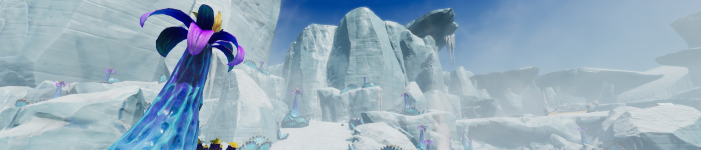
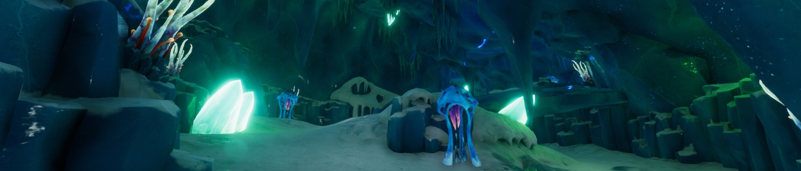
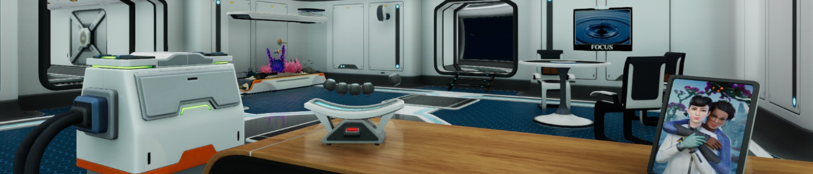
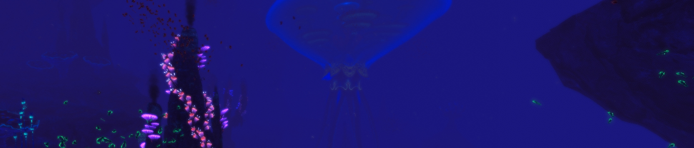
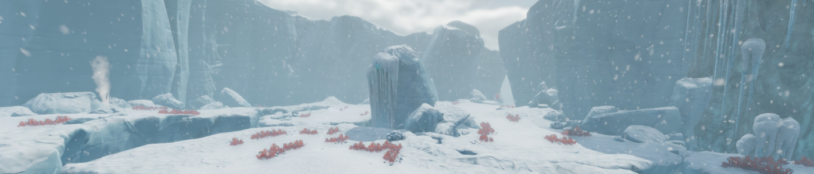
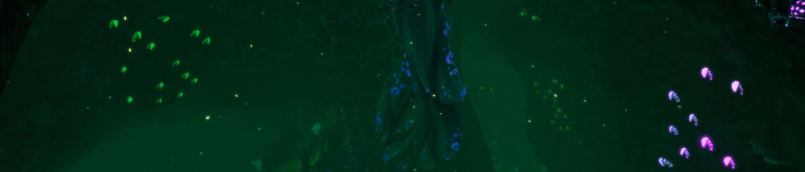
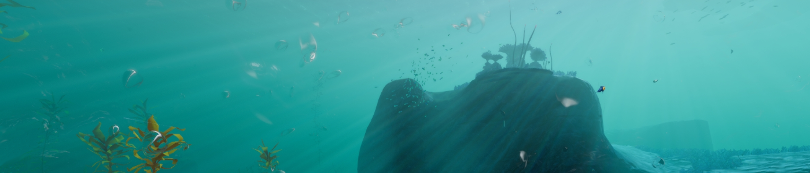
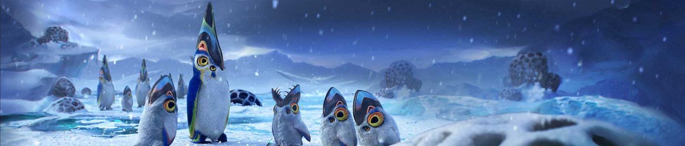

> # Alterra s’installe sur une nouvelle planète !
>
>L’information est tombée plus tôt dans la matinée : Alterra confirme l’implantation d’une équipe de recherche sur la planète 4546B. Pour rappel, un rapport publié il y a quelques mois par cette même société avait fait grand bruit : la découverte d'une nouvelle planète habitable, recouverte à 99% d’eau, avec un écosystème principalement sous-marin, des traces du passage d’une ancienne civilisation, et surtout un sol très riche en ressources !
>
>« Les formes de vie présentes dans les eaux de 4546B présentent des caractéristiques encore jamais vues, déclare le porte-parole d’Alterra. Nous souhaitons sans plus attendre envoyer des chercheurs étudier la faune et la flore de cette planète, car nous sommes convaincus que les connaissances qui en découlement feront progresser l’humanité. » On a hâte d’en apprendre plus sur le type de recherches menées !
>
>En ce qui concerne cet ex-employé d’Alterra, poursuivi par la méga-corporation pour détournement de ressources et réutilisation illégale de fragments du vaisseau Aurora, et dont le préjudice est chiffré à plusieurs centaines de milliards de crédits, son procès est toujours en cours. La défense maintient toujours sa position, selon laquelle ce sont les actions de son client qui ont permis de rendre la planète 4546B sans danger et l’atterrissage de vaisseaux possible. Cependant, aucune preuve n’a pu être produite pour soutenir ces propos. L’accusé encourt actuellement une peine de 750 ans de prison.

Tiens, ça faisait longtemps…

Connaissez-vous **la métaphore de l’iceberg** ? Non, je ne parle pas de la théorie de Freud sur la psyché humaine, mais plus généralement lorsque **la partie visible de quelque chose n’est rien par rapport à ce qui est caché sous la surface**. Un peu comme un iceberg, dont la partie immergée (et donc invisible) représente plus de neuf dixièmes de son volume.

Eh bien aujourd’hui, je vais vous parler d’un jeu pour lequel cette image colle parfaitement, et ce à plusieurs niveaux. C’et en allant de plus en plus dans les profondeurs des eaux de **Subnautica : Below Zero** que vous trouverez toute la richesse de ce jeu. Et en plus, il y a des icebergs !

# Retour sur la planète 4546B (Histoire et narration)

Suite aux évènements du premier jeu, **l’humanité a découvert une nouvelle planète**, et grâce aux actions d’un rescapé de l’Aurora (qui doit certainement croupir en prison suite à une dette monstrueuse), les vaisseaux peuvent maintenant aller et venir sans aucun souci. Il ne fallut pas longtemps à la société interplanétaire Alterra pour commencer à installer des **laboratoires de recherche** sur la planète 4546B, notamment à l’un de ses pôles.

C’est là que travaille Samantha Ayou, une ingénieure en robotique employée par Alterra. Enfin « travaillait », car elle a disparue dans un accident suite à une "négligence". Cette explication ne convient pas à sa sœur, **Robin Ayou**, qui décide de se rendre sur place clandestinement pour enquêter.

Après un atterrissage chaotique, la voici livrée à elle-même dans le **Secteur Zéro**, la zone de recherches polaire maintenant abandonnée. Il faudra se débrouiller seule pour survivre dans l'environnement hostile de la planète, que ce soit dans l'eau ou sur la banquise. **Seule ? Pas vraiment**, cette fois-ci on aura l'occasion de croiser d'autres personnages pendant notre aventure aquatique. Cependant, la narration passera en majorité par des documents textuels et audios, comme le précédent jeu.

Je pourrais en dire plus, mais **l’un des intérêts du jeu est la découverte de son histoire**. C’est pourquoi je ne souhaite pas trop la détailler - dans cette partie, tout du moins - et vous laisser la surprise au fur et à mesure que vous vous enfoncerez dans les profondeurs marines.

# Survie en milieu aquatique (Système de jeu)

Comme pour le premier Subnautica, le jeu vous demandera de **survivre** dans un environnement essentiellement aquatique. Il faudra gérer sa santé, sa faim, sa soif, son oxygène sous l’eau et, nouveauté dans cet opus, sa température sur la banquise. Les premières heures du jeu vous demanderont de vous débrouiller avec les moyens du bord. Mais si vous galérez à trouver un équilibre, ou que les jeux de survie ne sont pas votre truc, vous pouvez **désactiver certaines de ces jauges** dès le début de votre partie. Ce n’est pas quelque chose que je recommande personnellement, car **le jeu propose par la suite des équipements vous facilitant grandement la survie** (Je pense notamment à une certaine salade très efficace à la fois contre la faim, la soif et le froid !) pour vous permettre de vous concentrer sur l’exploration. 

**L’exploration**, justement, parlons-en : elle consiste à naviguer dans notre environnement à la recherche de **ressources** et de **plans de construction**. Elle est très limitée au début du jeu, car vos réserves d’oxygène sont très faibles et vous empêchent d’aller trop profondément. (On notera tout de même l’ajout de plantes à oxygène qui offre plus de fluidité dans l’exploration de certaines zones par rapport au jeu précédent.) Mais, petit à petit, vous allez trouver des plans pour **un meilleur équipement**, une plus grande réserve d’oxygène, une base sous-marine, et même des véhicules ! Ces améliorations vous permettront d’aller **explorer plus loin et plus profond** à la recherche de ressources plus rares et de nouveaux plans, et ainsi de suite.

Au chapitre des nouveaux équipements de Below Zero, je ne peux pas passer à côté de **l’Aquatracteur** : un véhicule modulable selon vos envies de mobilité ou de fonctionnalités. Il est composé d’une **cabine de pilotage** et de "wagons" (appelés **modules**) pour ajouter du stockage, un fabricateur, un lit, etc... La cabine seule représente un véhicule rapide et mobile, à l’image du Seamoth du jeu précédent, mais ajouter des modules impactera sa vitesse et sa maniabilité dans les endroits exigus. Les modules sont détachables à volonté et n’importe où, donc **c’est à vous d’organiser voter véhicule en fonction de vos besoins**.

**La construction de base s’étoffe aussi de nouveaux éléments**, comme une grande salle modulable avec des parois. Il y a aussi quelques ajouts cosmétiques, comme un jukebox ou des plafonds en verre pour profiter encore plus des fonds marins.

Mais n’allez pas croire que vous pouvez vous la couler douce pendant votre exploration ! La faune et la flore des fonds marins est aussi merveilleuse que dangereuse. Plus vous irez en profondeur, plus vous aurez de chances de tomber sur des **créatures hostiles**, dont les fameux monstres de classe Léviathan, des géants qu’il vaut mieux éviter. N’espérez pas en venir à bout, car l’arsenal à votre disposition pourra au mieux les repousser pour **vous donner le temps de fuir**.

# Le secteur Zéro (Design et banquise)

Bien que sur la même planète, les terrains de jeu de Subnautica et de sa suite sont très différents. Si le premier était déjà riche en variété d’environnements, Below Zero pousse cette diversité encore plus loin avec ses propres biomes sous-marins aux **visuels toujours plus impressionnants**, bien qu’ayant un terrain moins vaste. Des forêts de coraux, des nénuphars géants, des cavernes de cristaux... Chaque zone a sa propre identité, c’est toujours **émerveillant** d’en découvrir une nouvelle. Cerise sur le gâteau, le tout accompagné par **les musiques de Ben Prunty** (connu pour la musique de FTL), un musicien dont j'aime beaucoup les compositions au point de les écouter même en dehors du jeu.

Mais Subnautica : Below Zero, ce n’est pas que de l’exploration sous-marine : pôle gelé oblige, certains passages se feront **sur la banquise**. Et ça change beaucoup de choses. Tout d’abord, dans la manière de se déplacer, car il n’y a plus d’eau pour nous permettre de monter ou de descendre. Cependant, vous pouvez compter sur le **SnowFox**, une sorte de moto des neiges, pour vous déplacer plus rapidement. En surface, l’oxygène n’est pas un problème, mais le **froid mordant** du vent vous demandera de gérer votre température en vous déplaçant entre les abris et les points de chaleur. Et par-dessus cela la surface recèle son lot de dangers et de surprises.

# Que penser de cette seconde plongée ?

Lorsque je repense à ce jeu, la première chose qui me revient en tête est sa **direction artistique merveilleuse**. On a beau se retrouver en milieu polaire, quelle créativité dans les environnements ! **Quel spectacle de bioluminescences !** Et quel plaisir à découvrir ! On se croirait parfois dans un rêve – enfin, s’il n’y avait pas de monstres pour tenter de nous croquer.

Pour ce qui est du **gameplay**, orienté survie et collecte de ressources, je l’ai **rarement trouvé répétitif**. Le jeu nous donne petit à petit des outils pour nous **simplifier la tâche**, sans pour autant la rendre complètement triviale. Et puis, la découverte de nouveaux biomes est un excellent moteur pour nous inciter à explorer de plus en plus profond.

J’ai toutefois quelques réserves à apporter sur **l’exploration en surface**. Elle peut paraître moins maîtrisée, mais j'ai plutôt l'impression qu'**elle pâtit d'être comparée à l'exploration sous-marine**, plus riche sur beaucoup d'aspects et plus originale. L’océan est un festival de couleurs, alors que la surface est principalement blanche et souvent plongée dans la tempête de neige. Même les déplacements en SnowFox paraissent mous par rapport à un Seaglide, un petit dispositif de déplacement sous-marin. La découverte de la surface est au final **assez quelconque**, pas mauvaise, mais pas incroyable non plus. 

Pour l’aspect technique, je regrette que, malgré un **accès anticipé** de plus de deux ans, on trouve encore **des bugs dans la version « 1.0 »** du jeu : des objets qui disparaissent à travers le décor, quelques oublis de traduction, des collisions étranges, etc... Comme d'habitude, je vous souhaite qu'ils soient corrigés dans de futurs patchs.

Enfin, j’aimerais aussi vous donner mon avis sur certains **éléments scénaristiques**. Mais comme l’intérêt du jeu réside en partie dans son histoire, je vais laisser ceux qui veulent se garder le plaisir de la découverte sauter directement à sa conclusion. Si vous voulez un résumé de ce que je pense de l’histoire, disons qu’elle est globalement bien, mais que le jeu a du mal à faire cohabiter deux intrigues parallèles.



Un ajout par rapport au précédent opus que j’évoquais plus haut, c’est qu’on aura le droit à des **interactions** avec deux autres personnages.

On peut assez tôt faire la rencontre d'**Al-An**, l'un des derniers représentants des **Architectes**, une race extraterrestre disparue mais ayant laissé des traces de leur passage sur tout l’univers. Mais Al-An a un problème : **il n’a plus de corps**, et le sanctuaire qui sert à conserver sa conscience est sur le point de tomber en panne d’énergie. Il va donc trouver refuge dans le cerveau de Robin le temps qu'elle lui reconstruire un nouveau corps. À partir de ce moment, **Al-An assistera à notre aventure**, commentant, discutant et débattant avec notre héroïne sur ses actions, l'environnement, les humains et les Architectes. J'ai bien aimé ces moments de discussions, cela permet d'en apprendre plus sur le monde, les personnages, en plus de donner du relief à certains moments de l'histoire ou à certaines découvertes.

On fera aussi la connaissance de **Marguerite**, une aventurière. Peu amicale au début, elle nous menacera en pensant qu’on fait partie d’Alterra. Mais après lui avoir prouvé qu’on avait aucun intérêt dans la société interplanétaire, elle nous révélera avoir aidé Samantha, la grande sœur de Robin, dans la lutte contre un dangereux projet d'Alterra.

Comme vous le constatez, chaque personnage a son histoire : en réalité, **on suit deux intrigues en parallèle**. D’un côté, on cherche à connaître les circonstances de la mort de Samantha, liées au développement d'une arme biologique, et de l’autre il nous faut retrouver des plans et des ressources pour fabriquer un nouveau corps à Al-An. Si la première est à l'origine de la venue de Robin sur 4546B, seule la résolution de la deuxième semble nécessaire pour terminer le jeu. **On n'a jamais l'impression que les deux histoires sont vraiment liées** (à part quelques faibles connexions), mais plutôt que la première intrigue finit par être reléguée au second plan par rapport à la deuxième.



# Conclusion

Vous souvenez-vous qu’en introduction, je disais que l’image de l’iceberg correspondait bien au jeu ? D’abord par sa **structure** : on commence à la surface, notre vision de l’environnement est limitée par notre équipement, qui nous empêche d’aller trop bas. Pourtant, **tout nous invite à nous enfoncer dans les eaux profondes** : c’est là que se trouvent les matériaux les plus rares, les décors les plus somptueux, mais aussi les dangers les plus grands. L’histoire cache aussi bien son jeu : qui sait ce que peut dissimuler la disparition de la sœur de Robin ?

**Subnautica : Below Zero marche dans les pas de son prédécesseur.** Il reprend la formule, l’améliore sur certains points, l’agrémente à la sauce « Arctique », et y ajoute quelques éléments. Je ne trouve pas ça redondant avec le premier Subnautica, premièrement car l’exploration sous-marine est une proposition encore peu représentée, et les ajouts sont suffisants pour justifier une réelle différence. J’ai plus l’impression qu’il s’agit d’un aboutissement de la formule Subnautica en tirant parti de l’expérience du jeu précédent. Et puisque c’est un aboutissement, je souhaite aux développeurs de ne pas tomber dans le piège d’un troisième jeu sur la même structure, mais plutôt d’explorer de nouvelles possibilités.


* Jeu d'exploration et de survie en milieu aquatique.
* Développé par **Unknown Worlds**
* Sorti le **14 mai 2021** sur PC/PS4/XBox One/Switch en version finale.
  * **Accès anticipé** commencé le 30 janvier 2019.
* Joué en **début 2021** sur PC.
* Mon appréciation : **Toujours aussi émerveillé par les profondeurs de Subnautica, ce fut un vrai rafraîchissement pour moi.**


