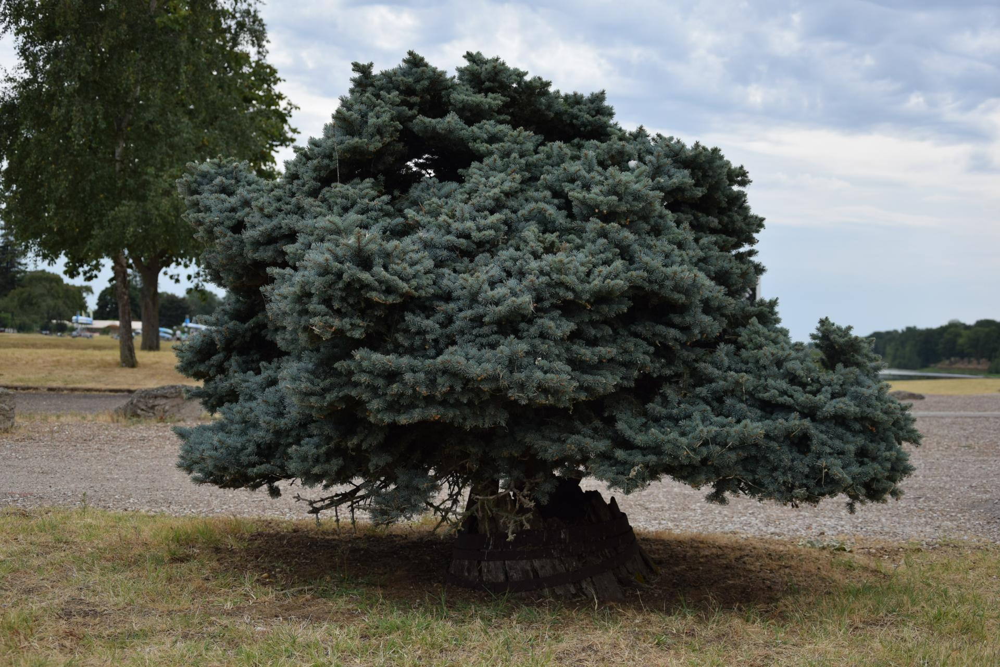

L'encadré info :


Bonjour, vous allez bien ?


Avec de la customisation :


On peut rajouter plein de choses dans les détails :

* des listes
* [des liens]()
* des images (voir plus bas)


Des encadrés "Spoiler" avec un système déroulant (appelé "accordéon")


Voici la fameuse image :



Le titre est aussi personnalisable :


Je suis en train de l'écrire, il sortira lorsque je l'aurai terminé.

