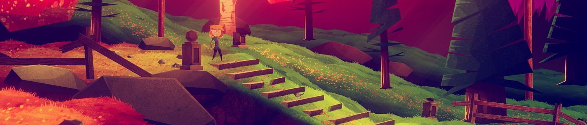

Je joue à beaucoup de jeux vidéo sur mon temps libre. Et pour certains, je n'ai pas forcément beaucoup de choses à dire, ou alors je n'ai pas envie de passer trop d'heures à disserter dessus. C'est pourquoi je vous propose d'en parler dans ce format court : les **critiques pressées**.

Pour cette première itération, je vous présenterai une compilation d'histoires fantastiques, un jeu qui ne veut pas être joué, et on verra que le travail de détective est à la portée de tous, même d'un chauffeur de taxi et d'une enfant de dix ans.

# Stories Untold

Je ne suis d'habitude pas très emballé par les jeux d'horreur, mais la proposition singulière de **Stories Untold** (ainsi que sa gratuité sur l'Epic Game Store) m'ont incité à lui laisser une chance. Ce que je n'ai aucunement regretté, car j'ai aimé découvrir les quatre histoires qui composent le titre.

En effet, *Stories Untold* se découpe en **quatre épisodes** nous racontant chacun une nouvelle fantastique de manière **minimaliste**. Chaque chapitre se déroule sur un ou deux écrans fixes, et nous demande d'utiliser des machines aux rôles variés. D'abord un jeu textuel qui interagit avec la réalité, puis des instruments de laboratoire autour d'un mystérieux sujet de test, pour ensuite se retrouver enfermé dans un poste de communication à décoder des messages et à rentrer des commandes. Si les interactions semblent anodines, **l'enrobage narratif** apporte tout son sel à l'expérience. Pas de surcharge d'effets, parfois **l'appréhension apparaît dans l'attente**, comme dans le deuxième épisode où chaque manipulation est faite dans la crainte que quelque chose échappe à notre contrôle. Je vous garde aussi la surprise du **dernier chapitre**, sachez juste qu'il apporte un liant assez surprenant au titre.

Seul défaut pour les non-anglophones : le jeu est en **anglais** et ne dispose pas de sous-titres français. Cela peut créer certaines complications, notamment lors de la deuxième histoire, où des consignes vous seront données à l'oral.

# Jenny LeClue - Dectectivú

La vie est belle à Arthurtown, petite ville où réside la jeune détective Jenny LeClue. Jusqu'à ce qu'**Arthur K. Finklestein**, l'auteur de la série de romans jeunesse en déclin **"Jenny LeClue"** reçoive un ultimatum de son éditeur : pour remonter dans les ventes et espérer continuer sa série, il faudra renouer avec le suspense, ajouter du danger, quitte à tuer un ou deux personnages. Et c'est cette nouvelle aventure que le jeu d'enquêtes nous propose de vivre.

Parlons justement de ces **enquêtes** : si nous retrouvons le classique schéma de *collecter des indices puis faire des déductions*, nous aurons aussi des phases d'analyse en détail d'individus permettant d'en apprendre plus sur eux et leurs précédentes activités. Le tout passe par le **carnet de notes** de l'héroïne, où elle y reporte ses découvertes et réalise ses déductions. Carnet que j'ai pris plaisir à parcourir et à personnaliser avec les autocollants à récupérer tout au long de l'aventure.

L'une des originalités du titre, c'est sa **double narration** : d'un côté on participe à l'aventure de Jenny, sur les traces d'un meurtrier et du grand mystère d'Arthurtown, et de l'autre on est témoin de la détresse de l'écrivain, voyant la tournure dramatique que prend son histoire. Il arrive que l'auteur et sa protagoniste aient des avis divergents, Jenny allant au-devant du danger là où Arthur préférerait qu'elle rebrousse chemin. Cela permet de créer quelques séquences comiques, car si le suspense est au rendez-vous, **l'humour est omniprésent** notamment avec les personnages décalés qui peuplent la petite ville. Tant qu'on est sur la narration, une récente mise à jour a ajouté des **doublages anglais de qualité** qui enrichissent l'expérience narrative.

On remarquera très rapidement la **direction artistique** du jeu qui lui donne une grande partie de son identité. Dommage que certains décors se chevauchent maladroitement, où que des figures secondaires aient manqué de fignolage sur leurs animations.

Mais il est temps de parler des deux points noirs de l'aventure. Premièrement, j'ai eu l'impression que le titre commençait à **s'essouffler sur sa deuxième moitié**, à partir du moment où on rentre dans le cimetière. Les enquêtes diminuent au profit de plus de phases de plateformes et de puzzles, ce que je trouve regrettable vu que les interrogatoires étaient ce que j'appréciais le plus du jeu jusque-là.

Quant au deuxième et plus gros soucis, c'est le système de choix, ou plutôt **l'illusion du choix**. *Jenny LeClue* s'inspire d'autres titres comme ceux de Telltale pour régulièrement proposer des décisions "importantes", qui sont d'ailleurs reportées dans le carnet de l'héroïne. Cependant, ces **choix n'ont pas de conséquences dans l'intrigue**, à une exception près il n'y a jamais de ramifications dans l'histoire. Alors pourquoi les présenter comme si c'était le cas ? Ce qui cristallise le plus ce problème est le choix proposé à la toute fin du jeu.



À la fin de l'aventure, alors qu'on apprend que le doyen Strausberry n'était pas vraiment décédé, l'histoire revient sur son auteur, contacté par un éditeur furieux de ce retournement de situation. **Il lui faut un mort**, sinon le livre ne sera pas publié. Finklestein se voit contraint de choisir entre trois de ses personnages principaux, et comme il ne peut pas se résoudre à prendre une décision, c'est à nous que revient la tâche de désigner la victime. Alors que l'on revient dans la diégèse de Jenny, une machine souterraine s'active, et là encore un choix nous est proposé entre trois leviers à activer.

À ce stade-là, **on pourrait s'attendre à neuf conclusions différentes**, mettant en scène la réaction des survivants en fonction de nos choix. **Mais il n'en est rien** : la personne désignée disparaît de la réalité, et le jeu conclut sur un écran *"à suivre..."*

C'est ce moment qui m'a fait remettre en cause tous les choix proposés lors de l'aventure : est-ce que se comporter bien ou mal envers Suzie, qui souhaite être amie avec Jenny malgré quelques gaffes, aurait changé à un moment la donne ? Y avait-il une différence entre laisser la scène du crime intact ou enlever les preuves incriminant la mère de la petite détective ? **Quelques vérifications çà et là me laissent penser que non.**

Enfin, **cette soi-disant mort n'est pas confirmée** : on voit le personnage désigné disparaître, mais rien ne confirme son trépas, surtout après les révélations faites sur le secret d'Arthurtown. On peut imaginer qu'il s'agit là d'une nouvelle pirouette scénaristique de l'auteur, mais je ne suis pas sûr que ce soit ce que demandait son éditeur.



Au final **je n'en veux pas au jeu d'être une histoire linéaire, mais plutôt qu'il ait tenté de me faire croire qu'il ne l'était pas**. Ce n'est pas facile d'écrire une aventure à embranchements, et il n'y a pas de honte à ne pas y arriver. Si une suite devait un jour sortir, je souhaiterais que les développeurs prennent une décision entre de vraies conséquences aux choix proposés et un récit linéaire assumé.

# There is no game - Wrong dimension

*Désolé, il n'y a pas de jeu ici !*

C'est ainsi que vous accueille **There is no game - Wrong dimension**, un jeu qui ne veut pas être joué, et qui tentera de vous le faire quitter par tous les moyens possibles. Et comme vous interagissez directement avec ce **non-jeu**, à la manière d'un point & click, c'est l'occasion de créer des situations absurdes en brisant la limite entre son univers et l'interface. Une clé est trop grosse pour entrer dans sa serrure ? Un coup dans un logiciel de compression saura réduire sa taille ! Il vous manque un rouage ? Peut-être pouvez-vous récupérer celui de l'écran de chargement... L'aventure fourmille d'**idées farfelues** dans ce genre.

Vous voyagerez aussi entre plusieurs styles de jeux vidéo - enquête, RPG, Free 2 Play malhonnête - pour vous y frayer votre chemin de manière détournée, accompagné par **la voix du non-jeu**. D'abord présente pour vous inciter à fermer le programme, elle deviendra le guide de votre périple à travers les dimensions vidéoludiques.

J'aimerais pouvoir vous en dire plus, mais comme apparemment il ne s'agit pas d'un jeu, comment pourrais-je en parler ? Cependant, si d'aventure il vous est donné la possibilité, disons, d'interagir avec, alors je vous le **recommande** chaudement !

# Night Call

Les nuits sont dangereuses à Paris, surtout depuis qu'un **tueur en série** rôde dans ses rues. Sa dernière victime ? Houssine, un chauffeur de taxi. Mais celui-ci arrive à survivre à ses blessures mortelles, ce qui attire l'attention de l'inspectrice de police Brusset. Elle lui propose un marché : soit il l'aide dans ses investigations, en posant des questions à ses clients et en enquêtant sur les suspects, soit elle fait de lui le coupable idéal de ces assassinats. Notre protagoniste est donc contraint de concilier son travail de **conducteur de taxi nocturne** à celui d'**indic** pour les forces de l'ordre.

Le jeu nous propose **trois enquêtes** avec des suspects, des intrigues et un coupable différent, mais fait le choix très discutable de **recycler la structure de l'histoire**. Vous voyez le paragraphe précédent ? Eh bien il se répète sur les trois scénarios, et il va de même pour la conclusion. Du coup, on a une désagréable sensation de déjà-vu lorsqu'on lance la deuxième enquête. La forme ne change pas, du coup le fond devient de plus en plus prévisible. Il ne m'a pas fallu beaucoup de nuits pour deviner les assassins de la deuxième et troisième affaires. Mais ce n'est pas si grave, car cela permet de consacrer plus de temps à la partie la plus intéressante du titre.

En tant que conducteur de taxi, vous passez la plupart de votre temps à déambuler dans Paris et à rencontrer ses habitants nocturnes. À chaque client son histoire, et **le jeu n'est pas avare en personnages** : des ivrognes, des voyageurs, un avocat, des journalistes, un justicier masqué, des SDF, des rencontres paranormales et j'en passe. De mon point de vue c'est son principal attrait : rencontrer des gens, commencer à échanger avec eux, tenter d'en apprendre plus, ou au contraire laisser notre protagoniste se confier à eux, jusqu'à arriver à destination. Il nous sera parfois demandé de **choisir entre plusieurs réponses** pour prolonger la discussion tout en évitant de froisser nos interlocuteurs.

L'interface est reconnaissable : **tout en noir et blanc souligné de jaune**, la moitié haute de l'écran est dédiée à la carte de la capitale alors que l'autre montre une vue de l'habitacle du véhicule. On y voit notre hirsute chauffeur dialoguer avec ses clients installés sur la banquette arrière. 

Enfin, il faut que je rapporte ce **bug** gênant que j'ai eu par deux fois : en arrivant sur un lieu d'intérêt, il m'est arrivé de m'en faire éjecter sans aucune raison au bout de deux secondes, et sans possibilité d'y retourner. C'est d'autant plus problématique que ces passages sont censés nous aider à trouver beaucoup d'indices pour notre investigation.

Si je dois recommander *Night call*, ce n'est certainement pas pour ses enquêtes, mais plutôt **pour ses personnages et leurs histoires**. D'ailleurs, le mode "ballade" ajouté dans le jeu il y a quelques mois permet de se libérer des contraintes de détective pour se concentrer sur les rencontres avec les habitants nocturnes de la ville lumière.

