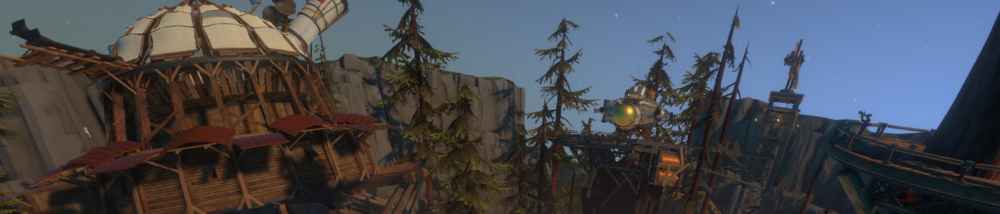
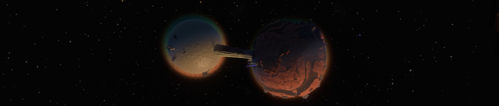
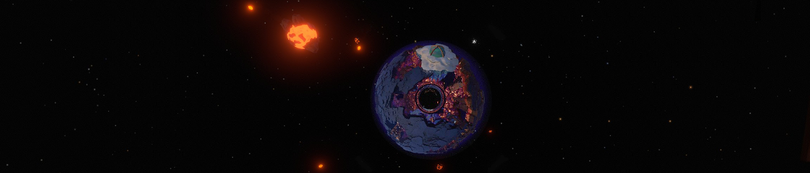
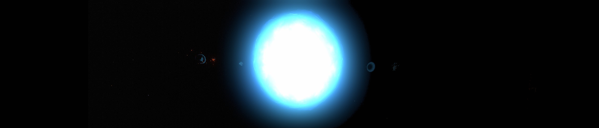
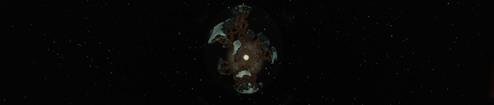

>*Le jour tant attendu était enfin arrivé.*
>
>*Aujourd'hui commençait une nouvelle aventure, de nouveaux défis.*
>*En ouvrant les yeux, il se remémorait ses expériences passées. Son appréhension, certes présente, ne saurait réfréner sa soif de nouveautés.*
>*Il allait marcher dans les pas de quelques grands avant lui, des semblables qu'il admirait. Grâce à ses connaissances, il apporterait fièrement sa pierre à l'édifice.*
>
>*Ce n'était peut-être pas le plus fort ou le plus courageux, mais son brin de jugeote l'avait jusque là permis de tirer son épingle du jeu. L'entraînement et les préparatifs furent longs, mais tout cela lui permettrait à terme de repousser les limites de la découverte. C'était tout du moins ce qu'il espérait.*
>
>*Oui, aujourd'hui commençait une nouvelle aventure.*
>
>*Mais ce qu'il ignorait encore, c'est que ce serait sa dernière et plus longue journée.*

&nbsp;

Comment commencer ce blog, si ce n'est pas en parlant d'un des jeux auxquels j'ai récemment joué ? Et parmi eux, celui qui m'a le plus marqué est **Outer Wilds**,
qui vous propose d'explorer l'espace pour résoudre ses mystères.

# Le début de l'aventure

Le jeu commence par le réveil de votre personnage, à côté d'un feu de camp. Vous êtes sur **Âtrebois**, planète connue pour ses forêts, ses geysers et ses "Âtriens",
peuple à peau grise disposant de quatre yeux et d'un certain don pour générer des explosions. Ce dernier trait est principalement lié à leur dernière initiative,
le **Programme Odyssée**, un programme spatial d'exploration du système stellaire. D'ailleurs, vous en êtes la dernière recrue,
et ce jour marque le début de votre aventure spatiale, car c'est celui de votre premier décollage.  
Votre première mission sera d'abord de récupérer les codes de lancement de votre navette, ce qui est en réalité un prétexte pour vous balader dans le village,
rencontrer ses habitants et proposer quelques tutoriels qui vous aideront à vous familiariser avec votre matériel ainsi que la navigation en microgravité.
**Le musée de l'observatoire** est aussi riche en informations, car présentant des connaissances et des objets provenant des précédentes missions spatiales.

C'est d'ailleurs l'occasion d'évoquer la votre, de mission : enquêter sur les **Nomais**, un peuple disparu depuis fort longtemps, et dont on trouve les ruines
sur la plupart des planètes du système. Tout ce que l'on sait d'eux, c'est qu'ils ne sont pas originaire d'ici, et qu'ils ont mystérieusement disparu après s'être
installés sur les astres avoisinants. D'où viennent-t-ils ? Que venaient-ils chercher dans ce système stellaire ? Pourquoi ont-ils disparu ?
Tant de questions auxquelles répondre. Et pour vous aider dans cette tâche, il vous sera remis un **traducteur portatif**, dernière invention Âtrienne
qui vous permettra de décoder les écrits Nomais reposant çà et là.

# Plus d'un monde à découvrir

Après l'explication de la mission, le traducteur et les codes de lancement récupérés, il ne vous reste plus qu'à monter à bord de votre fusée
et effectuer votre premier décollage. Qu'allez-vous explorer en premier ? Commencerez-vous par un saut de puce en atteignant **la Rocaille**,
le satellite d'Âtrebois ? Irez-vous explorer les insolites **Sablières** dont le sable de l'une se déverse dans l'autre, quitte à vous approcher du Soleil ?
Êtes-vous plutôt curieux de savoir ce que cache l'atmosphère verte et opaque de **Léviathe** ? La surface de **Cravité**, la planète creuse ?
Ou bien vous sentez-vous assez courageux pour explorer l'espace distordu de **Sombronces** ? (Vous noterez d'ailleurs la qualité de l'adaptation française.)

Chaque astre a **sa propre identité**, des mécaniques uniques qui le caractérise. Il vous faudra les comprendre pour percer certains mystères et progresser.
L'exemple le plus parlant est celui de la **Lune Quantique**, satellite "farceur" qui orbite autour de toutes les planètes du système,
change de place dès qu'on lui tourne le dos, et disparaît lorsque l'on tente de se poser dessus. Il doit pourtant bien exister un moyen de se poser dessus, non ?
Certains écrits Nomais parlent de pèlerinage sur la Lune...

La navigation entre ces destinations insolites est d'ailleurs très fluide, ce qui est lié principalement à la taille relativement minuscule du système :
le tout tient dans un rayon de **25 kilomètres autour du Soleil**, et les planètes ne dépassent pas le kilomètre de diamètre. Pas besoin donc de vitesse lumière
ou de longs voyages interplanétaires, vous pouvez décoller en quelques secondes et atteindre l'autre bout du système en moins de 5 minutes.
Pensez cependant à ralentir suffisamment en avance à l'approche de votre destination, ou vous risquerez de vous crasher dessus plutôt que d'atterrir en douceur.  
Il ne faudra pas non plus négliger la **gravitation** qui pourra venir entraver certains de vos mouvements, ou vous envoyer dans le Soleil
si vous vous en approchez de trop près. Mais apprenez à la maîtriser, et vous serez alors capable de décrire des orbites autour des astres et d'utiliser leur proximité
pour vous propulser dans une direction.

# [La fin des temps](https://www.youtube.com/watch?v=t5vG4Be1Ci8 " Aussi connu sous le nom de 'Final hours 2'")

Un autre mystère à résoudre vous apparaîtra avec le décès de votre avatar. Lorsqu'il passe de vie à trépas, c'est pour se réveiller à côté du feu de camp,
avant son premier décollage, mais en ayant gardé en mémoire ses expériences. Cette **boucle temporelle** ne sera pas de trop,
car si ce n'est pas l'environnement hostile de certaines planètes ou quelques mauvaises manœuvres de pilotage, l'effondrement du Soleil en **supernova**
mettra aussi fin au cycle en annihilant l'intégralité de votre terrain de jeu. Vous voici donc contraint à revivre, encore et encore,
les vingt-deux dernières minutes du système stellaire, ce qui n'est pas sans rappeler les trois derniers jours de Termina dans *Majora's Mask*.

Au mystère des Nomais s'ajoute donc ceux de la fin de vie du Soleil et de la boucle temporelle, et bien d'autres les rejoindront. Ça vous semble compliqué à suivre ?
Pas d'inquiétudes, votre fusée est équipée d'un **journal de bord**, dont le contenu est conservé à chaque retour dans le temps.
Il vous sera très utile, car il consigne toutes vos découvertes par astre, et dispose d'un mode *Rumeurs*, qui vous aidera à connecter les informations entre elles
et choisir votre prochaine destination.

# [Mon voyage dans l'espace](https://www.youtube.com/watch?v=4d13puTqhq0&t=68 "Vidéo non contractuelle")

Après cette longue description de tout ce que le jeu a à vous proposer, je pense pouvoir vous donner mon avis dessus.

Premièrement, j'aime beaucoup ce qu'ils ont fait de **l'exploration spatiale**. Une fois la navigation maîtrisée,
il est agréable de se promener dans le système stellaire, notamment grâce à sa petite taille et les faibles distances à parcourir pour aller d'un endroit à un autre.
Le pilotage n'en reste pas moins assez souple, proposant un système de ciblage et d'alignement de vitesse pour vous "immobiliser" par rapport avec votre cible,
ainsi qu'un pilote automatique. Votre vaisseau se redresse aussi automatiquement à proximité d'une planète,
vous permettant de vous poser sur ses tains d'atterrissage plus facilement.

Niveau exploration, j'ai été impressionné par la **diversité des planètes**. Elles n'ont beau être "que" six,
elles sont grandement différentes les unes par rapport aux autres. De plus, leur petite taille permet d'éviter le syndrôme des "grands espaces vides",
où il faut errer pendant des dizaines de minutes pour trouver un point d'intérêt. Cela serait d'ailleurs rentré en conflit avec la **limite de temps**
de la boucle temporelle. Au contraire, Outer Wilds a bien pensé son *level design*, et aucune expédition n'a besoin de l'intégralité d'un cycle.

Le mystère de la **Lune Quantique** est ce qui m'a le plus fasciné dans mon exploration. Son caractère insolite, décrit plus haut, fait d'elle
l'astre le plus difficile à approcher. Pour l'appréhender, il faudra vous aider des fragments échoués sur différentes planètes,
inspecter les bâtiments Nomais la concernant et réaliser des expériences par vous-même. C'est là encore très caractéristique de la progression dans le jeu :
vous ne débloquez pas de nouvelles compétences ou améliorations, mais vous acquérez des connaissances qui agissent comme des clés pour progresser.
Rien n'est plus satisfaisant que de connecter les informations dans cette **grande enquête spatiale**, et d'arriver de cette manière
à des endroits auparavant inaccessibles.

# Conclusion

Vous l'avez probablement deviné, j'ai passé un excellent moment sur Outer Wilds. L'espace, les enquêtes, l'exploration et la réflexion sont des thèmes que
j'affectionne beaucoup, et il réussit beaucoup de choses en les combinant. Découvrir la variété des planètes et marcher dans les pas d'une civilisation ancienne
ont été de très grands moteurs pour moi. Et à la fin, quand toutes les informations se recoupent pour pointer une destination finale, qui ne sera pas atteignable
sans prendre de gros risques, tout cela forme une expérience marquante que je vous encourage à vivre.

>**Outer Wilds**
>
>Jeu d'aventure et d'exploration spatiale.  
>Développé par **Mobius Digital**  
>Sorti en **mai 2019** (PC et Xbox One) puis en **octobre 2019** pour la PS4  
>Joué en **juin 2020** sur **PC** (Steam)  
>Mon appréciation : **Paré pour un nouveau décollage !**

# Pour aller plus loin

Pour terminer, j'aimerai vous partager quelques liens qui pourraient vous intéresser :

* Si vous souhaitez recouper des points de vue différents, je vous recommande les critiques du jeu par [Mr Plouf](https://www.youtube.com/watch?v=9NQN0OXQVZE)
  et [Pseudoless](https://www.youtube.com/watch?v=6arY8ZC9_-0) :





* Si vous avez déjà joué au jeu, et que vous souhaitez approfondir l'expérience, je ne peux que vous conseiller d'écouter le podcast
  [Fin du Game](https://www.youtube.com/watch?v=hPTxNZPyVw8), qui analyse le jeu sous toutes les coutures :



* Et si vous n'avez pas trop de difficultés avec l'anglais, le documentaire de [Noclip](https://www.youtube.com/watch?v=LbY0mBXKKT0)
  décrit le processus de création du jeu, et explique certains défis techniques rencontrés :



