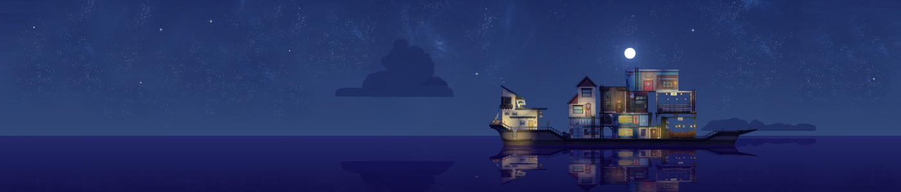

> *<< Quel paysage merveilleux ! As-tu trouvé cet endroit toi-même, Annie ? >>*
>
> *Son interlocutrice mis du temps à réagir. Elle n'avais pas vraiment l'habitude d'être appelée par ce nom. Elle acquiesça de la tête en direction de la dame âgée, remuant par la même occasion son grand chapeau en forme d'étoile.*
>
> *<< Ces arbres sont exquis... Eugène sera fâché d'avoir manqué ça ! Il pourra prendre quelques jours de congés l'été prochain...*  
> *Oui, revenons ici. Je pourrais rester ici à tout jamais... >>*
>
> *La jeune personne en face d'elle ne put répondre que par un sourire gêné. Ne se rendait-elle pas compte du macabrisme se dégageant de ses paroles ? Ou alors, était-ce un éclat de lucidité au milieu du brouillard ? Elle préféra garder ses réflexions pour elle.*
>
> *<< Tu ne m'as pas parlé de l'école, récemment. >>*
>
> *En effet, car ça faisait des années qu'elle n'y allait plus.*
>
> *<< Est-ce que tout se passe bien ? Et tes notes, sont-elles...*  
> *Oh ! Évidemment, tu es diplômée depuis longtemps. Je suis désolée, je ne sais pas pourquoi je suis si confuse. >>*
>
> *Un peu perdue, la vieille dame marqua une pause, tout en passant machinalement une par une les perles de son collier entre ses doigts. La femme au chapeau s'était toujours demandée quelle était la bonne approche envers ce genre de personnes. Essayer de les ramener à la réalité lui avait paru être la seule réponse correcte au début, mais à force de toujours les voir retourner dans la brume de leurs souvenirs, à quoi cela servait-il de s'obstiner ? Il est bien plus facile de les accompagner dans leur délire. Et pourtant...*
>
> *<< ... Tu es... Tu n'es pas Annie, hein ? >>*
>
> *D'un nouveau mouvement de tête, la personne que l'on tentait d'appeler Annie confirma les doutes de son interlocutrice.*
>
> *<< Mais oui, voyons... Je pense que je perds un peu la mémoire, dernièrement... >>*
>
> *Le silence s'installa à nouveau. Toutes deux continuèrent à avancer le long de la promenade. La santé de l'aînée s'était beaucoup dégradée ces derniers jours, au point où elle avait des difficultés à mettre un pied devant l'autre. Mais elle avait insisté pour effectuer cette dernière sortie, avec l'aide de sa jeune amie. L'une soutenant l'autre, elles progressaient lentement sur le sentier, jusqu'à ce que la dame au collier demanda à marquer une nouvelle pause. Le duo s'arrêta alors devant une grande arche, dont le reflet dans l'eau formait un cercle parfait.*
>
> *<< Peut-être qu'Eugène va... >> commença la personne âgée, mais elle s'interrompit au milieu de sa phrase. Cherchait-elle la suite, ou bien manquait-elle de souffle ?*
>
> *<< Lorsque tu verras ton père, parle-lui des arbres, veux-tu ? Je suis certaine qu'il sera excité de se joindre à jours la semaine prochaine. >>*
>
> *Son accompagnatrice commençait à avoir du mal à retenir sa tristesse. Elle prit la vieille dame dans ses bras, qui lui rendit son geste affectueux. Si certains de ses souvenirs lui faisaient défaut, sa bienveillance restait intacte.*
>
> *Jamais il n'y eut de semaine prochaine pour la dame au collier.*

Si beaucoup de jeux mettent en scène **la mort**, principalement celle de centaines d'ennemis face aux assauts des personnages jouables, très peu d'entre eux cherchent à approfondir le sujet et à décrire ce qu'il y a autour : ce qui la précède, ce qui la suit, ce qui se passe pour ceux qui restent. Le jeu que je vais aborder aujourd'hui en a fait son thème principal, et prend même place dans le royaume des morts. Et non, ce n'est pas *Grim Fandango*, mais vu qu'on le mentionne, j'en profite pour vous inviter à y jouer, ce jeu est excellent.

Cette fois-ci, on va plutôt naviguer d'île en île, faire des rencontres, passer du temps avec elles avant de leur dire adieu. Le jeu du jour est **Spiritfarer**.

# Souvenirs de ceux qui nous ont quittés

Alors qu'ils se réveillent sur une barque traversant des flots carmins, **Stella** et son chat **Daffodil**, les personnages principaux de cette aventure, s'aperçoivent que leur embarcation est tirée par celle d'une imposante silhouette encapuchonnée. Une fois arrivés devant leur destination, l'inconnu se présente : il s'agit de **[Charon](https://fr.wikipedia.org/wiki/Charon_(mythologie) "Saviez-vous que ça se prononçait 'Karon' ? Moi je le découvre à l'instant.")**, le passeur d'âmes. Ils se trouvent actuellement devant le **Seuil Éternel**, là où se rendent les âmes lorsque leur heure est venue. Ce n'est cependant ni à la jeune femme, ni à son compagnon félin de traverser le Seuil aujourd'hui, mais au vieux nocher qui y a conduit un nombre incalculable d'esprits au fil des siècles. Si Stella est présente ici, c'est pour prendre sa suite en tant que **nouvelle passeuse d'âmes**, au vu des compétences acquises de son vivant. Pour l'aider dans se tâche, Charon remet au duo la **Lanternelle**, un puissant objet magique qui les aidera dans un grand nombre de situations. Le passage de flambeau terminé, il est temps pour le nocher millénaire de quitter sa remplaçante, de même que ce monde. Quant à Stella, il lui faut maintenant trouver un bateau digne de ce nom pour conduire les esprits vers l'au-delà.

C'est accosté à une petite île proche du Seuil Éternel qu'elle trouvera un bateau abandonné, ainsi qu'un premier esprit à accueillir à son bord. Il s'agit de **Gwen**, une ancienne connaissance de l'héroïne. Il faut préciser que, dans le monde des morts, les esprits prennent soit l'apparence de silhouettes encapuchonnées, soit d'animaux dès qu'ils montent sur le vaisseau de la passeuse d'âmes. Pour Gwen, elle est présentée sous la forme d'un cerf, mais on pourra rencontrer lors du voyage un buffle, une grenouille, un hérisson ou encore un champignon à quatre bras.

**Chaque personnage a sa propre histoire à raconter**, à condition que vous leur portiez une oreille attentive. Gwen par exemple nous parlera sa vie dans une famille bien aisée, ses relations compliquées avec ses parents dues à son tempérament espiègle, et se remémorera sa jeunesse avec Stella qui la considérait comme sa sœur. Elle évoquera aussi son addiction à la cigarette dès son plus jeune âge, ce qui aura grandement participé à réduire son espérance de vie. Je vous laisse la découverte des récits autres personnages, car c'est ce qui fait le principal intérêt du jeu. Sachez que, comme pour Gwen, **ils partageront avec vous aussi bien les bons souvenirs que les mauvais**, leurs fiertés autant que leurs regrets.

# Pas de repos éternel pour les braves

En possession de votre propre bateau, il est maintenant temps de détailler ce que vous pouvez en faire :

* **Naviguer**, évidemment ! Car le monde de Spiritfarer est composé d'**îles** réparties dans un grand océan, sur lesquelles vous trouverez des ressources, des habitants, des marchands ou des trésors. Vous trouverez aussi des **points d'intérêts** en pleine mer, permettant d'obtenir des ressources spécifiques à la suite d'une séquence de jeu de plateformes, mais il vous faudra auparavant découvrir l'esprit correspondant pour déclencher ces activités.

* **L'améliorer** : vous pourrez construire différents **ateliers** sur le pont de votre navire pour cultiver et transformer vos ressources. Les âmes que vous accueillerez vous demanderont aussi à avoir une place pour dormir, un endroit où ils se sentiraient comme chez eux. Il ne tient qu'à vous de construire **la cabine de leurs rêves**. Enfin, il existe aussi un chantier naval qui vous permettra **d'agrandir votre bateau**, histoire d'avoir plus d'espace de construction, et d'acheter des améliorations afin de franchir certains obstacles marins.

Au cours de vos pérégrinations, vous rencontrerez des esprits qui souhaiteront monter à bord de votre embarcation en échange d'une **obole**. Ce paiement vous sera utile pour débloquer de **nouvelles capacités** aux sanctuaires disséminés çà et là. 

Mais il ne faut pas oublier de **vous occuper de vos invités** : vous aurez à les **nourrir**, tout en sachant que chacun a ses préférences, et vous pourrez leur faire des **câlins** pour leur remonter le moral. Ils vous adresseront aussi des **demandes particulières** qu'il vous faudra remplir dans une suite de quêtes : se rendre sur une île, récolter certaines ressources, leur donner un objet spécifique, construire ou améliorer des bâtiments sur votre navire, parler à certaines personnes, et j'en passe. **Plus un esprit est heureux, plus il vous aidera dans votre tâche**, en préparant des plats, en récoltant ou travaillant des ressources pour vous. De plus, son histoire se dévoilera au fur et à mesure que vous l'aiderez. 

Cette liste de requêtes se terminera souvent de la même façon : au moment venu, **votre convive vous demandera de l'amener au Seuil Éternel**. La fin du trajet se faisant en barque, ce sera l'occasion de discuter une dernière fois avec lui et d'échanger une dernière embrassade avant de le voir passer de l'autre côté.

# L'enfer est pavé de bonnes intentions

J'ai cependant **quelques soucis avec la manière dont le jeu est équilibré entre histoire et gameplay**. Ce dernier se base sur la culture, la récolte et la transformation de ressources. Cela vous demande de naviguer entre îles et points d'activités pour y récupérer des matières premières, et il faudra profiter du temps de trajet pour pour **transformer vos matériaux aux ateliers correspondants**. Comme pour d'autres jeux de ce genre, il faut trouver le bon équilibre pour éviter d'avoir l'impression de récolter et de travailler du bois en boucle.

Le problème de Spiritfarer, c'est que cette **répétition s'étend aussi aux activités en mer**. Par exemple, vous en débloquerez rapidement une consistant à aider un dragon pour obtenir du quartz, puis une semblable avec un autre dragon pour obtenir de l'aluminium, puis une troisième pour l'argent, puis une quatrième pour l'or. Les gameplays sont similaires, il n'y a que la difficulté qui augmente. Sachant qu'il vous faudra faire les activités avec chaque dragon plusieurs fois pour obtenir suffisamment de ressources, **le sentiment de toujours faire la même chose s'en retrouve décuplé**.
C'est aussi le cas des quêtes des passagers, il n'y a pas assez de diversité pour tenir sur les **vingt-cinq à trente heures que dure le jeu**. Si bien que lorsque vous vous arrêtez devant un esprit et que celui-ci commence à vous raconter son histoire, vous avez parfois l'impression de perdre votre temps et vous passez les dialogues un peu vite. **On se retrouve dans un cas où le gameplay dessert la narration.** Ce qui est fort dommage, car le jeu a des choses intéressantes à raconter à travers ses personnages.

Un petit mot sur la technique : **j'ai apprécié les graphismes** tout en dessins animés avec talent, j'aurais bien aimé aussi voir des cinématiques avec cette direction artistique pour marquer certains points forts du jeu. J'ai aussi rencontré quelques **bugs** lors de ma partie, ainsi qur quelques **crashs** sur des sessions de jeu un peu longues, mais sachant que j'ai joué à Spiritfarer que quelques semaines après sa sortie, j'espère que les développeurs corrigeront tout ça dans de futures mises à jour. J'en finis avec les reproches en pointant du doigt la **traduction française parfois trop littérale**, traduisant par exemple *"Here we are!"* par *"Nous sommes ici !"*.

Enfin, il faut savoir que le jeu dispose d'un **mode coopératif** où le deuxième joueur incarne Daffodil, mais ne l'ayant pas essayé je ne peux pas vous en parler.

# Le travail d'une vie

Tout au long du jeu nous croisons des esprits nous narrant l'histoire de leur vie. Mais qu'en est-il la protagoniste du jeu ? **Quel était sa vie de Stella avant de devenir passeuse d'âmes ?**


Si vous préférez les découvrir par vous-même, vous pouvez directement sauter à la [Conclusion](#conclusion).


Cette histoire est disséminée tout au long du jeu de manière plus ou moins évidente. Elle est déjà narrée à travers les esprits que l'on accueille à bord, car beaucoup d'entre eux connaissaient leur hôte de leur vivant. Je parlais de Gwen plus haut, mais ce n'est pas la seule. Aussi, il y a dans le jeu des séquences oniriques où des images de la vie de Stella se manifestent, permettant d'avoir une idée sur qui elle était.

Mais ce n'est pas tout, et pour nous aider dans la compréhension de certains détails, je vous propose un extrait de [la newsletter de Thunder Lotus](https://us9.campaign-archive.com/?u=0433afe635fdac757a8565904&id=003cc78dc1), les développeurs du jeu :


>*Stella is a fictional character who was a Palliative Care Nurse, someone in charge of helping increase the quality of life of patients with a serious illness.*
>
>*She accompanied those that might not have much time left on this world, and ease their pain by being there for them, right up until she became ill herself.*
>
>*In game, you play through Stella's fleeting memories as she reminisces about her family visits to Alsace during her childhood; about her new found friendships while visiting Shirakawa-gō during her early adulthood; about her patients as she worked a health worker in Oxbury; and about her anxiety filled nightmares when she learned of her rapidly advancing cancer.*
>
>*Every location you visit, spirit you meet and events you encounter are tied directly to Stella's life, or rather how she remembers it... as her life fleets away.*
>
>*You are the helping hand guiding her through her last voyage to meet Hades.*

Traduction (faite avec [Deepl](https://www.deepl.com/home "Bien meilleur que Google traduction")) :

>*Stella est un personnage fictif qui était infirmière en soins palliatifs, une personne chargée d'aider à améliorer la qualité de vie des patients atteints d'une maladie grave.*
>
>*Elle accompagnait ceux qui n'avaient peut-être plus beaucoup de temps à vivre, et soulageait leur douleur en étant là pour eux, jusqu'à ce qu'elle tombe elle-même malade.*
>
>*Dans le jeu, vous jouez avec les souvenirs fugaces de Stella se remémorant ses visites familiales en Alsace pendant son enfance, ses nouvelles amitiés formées lors de sa visite à Shirakawa-gō au début de sa vie adulte, ses patients alors qu'elle travaillait comme auxiliaire de santé à Oxbury et ses cauchemars remplis d'anxiété lorsqu'elle a appris qu'elle était atteinte d'un cancer qui progressait rapidement.*
>
>*Chaque endroit que vous visitez, chaque esprit que vous rencontrez et chaque événement que vous rencontrez sont directement liés à la vie de Stella, ou plutôt à la façon dont elle s'en souvient... alors que sa vie s'écoule.*
>
>*Vous êtes la main qui la guide dans son dernier voyage à la rencontre de Hadès.*



*<<Chaque endroit que vous visitez, chaque esprit que vous rencontrez et chaque événement que vous rencontrez sont directement liés à la vie de Stella.>>* Si on a déjà expliqué que les esprits sont pour la plupart des connaissances de l'héroïne, il est intéressant de noter que **les décors des îles rappellent les lieux dans lesquels elle a vécu**. On croise des maisons à colombages et des forêts de conifères qui évoquent l'Alsace, des architectures japonaises traditionnelles inspirées de Shirakawa-gō, ou encore Oxbury qui est une île urbaine inspirée de Montréal que l'on visite dans le jeu.

Mais la partie la plus intéressante est au début de l'extrait : *<<Stella [...] était infirmière en soin palliatifs, [...] elle accompagnait ceux qui n'avaient peut-être plus beaucoup de temps à vivre, et soulageait leur douleur en étant là pour eux.>>*. Or, tout le long du jeu, elle est aux petits soins des esprits qu'elle accueille sur son navire avant de les emmener dans l'au-delà. Dans la mort comme de son vivant, Stella a toujours accompagné des personnes jusqu'à leur trépas tout en se mettant à leur service. **Le travail de la passeuse d'âme est en réalité un écho à son ancien métier d'infirmière.** Et le jeu devient à ce moment-là une représentation du réel. On est alors tenté de rattacher certains éléments à notre monde. Par exemple, la forte sensation de répétition dans les mécaniques de jeu racontent la pénibilité du travail des professionnels de santés. Notez cependant que si cela explique ce défaut énoncé plus haut, je le considère tout de même toujours comme nuisant à la narration de l'histoire des esprits. Mais dès que les clés de compréhension sont là, on voit beaucoup mieux la cohésion entre narration et gameplay.

# Conclusion

Pour ceux ne redoutant ni la mélancolie ni la répétitivité, Spiritfarer saura vous porter sur ses flots. Il se dégage du titre une ambiance chaleureuse contrastant avec le thème de la mort, d'ordinaire glacial. J'ai surtout apprécié les histoires des nos passagers, à condition d'être attentif à ce qu'ils disent. On fait beaucoup de choses dans le jeu, peut être trop, il faut donc apprendre à faire une pause de temps en temps et se laisser couler. Après tout, *[nous avons toute la mort pour nous reposer](https://www.youtube.com/watch?v=uoMMONfHBK8 "Je me sens d'humeur musicale aujourd'hui !")*, disait le chanteur philosophe.


* Jeu de gestion cozy sur le thème de la mort.
* Développé par **Thunder Lotus Games**
* Sorti le **18 août 2020** sur PC/PS4/XBox/Switch/Stadia.
* Joué en **septembre 2020** Nintendo Switch.
* Mon appréciation : **Personnages attachants, décors magnifiques, possibilité de personnaliser son bateau... Au final, Spiritfarer d'a qu'un gros défaut, qu'il partage avec l'éternité : c'est long, surout vers la fin.**


# Pour aller plus loin

Même si ce n'est pas grand chose, j'ai cette fois-ci plus de lines à vous partager que la dernière fois.

Dans un premier temps le [site officiel](https://thunderlotusgames.com/) et le [serveur Discord](https://discord.com/invite/4RYq42b) de Thunder Lotus Games, pour échanger en anglais avec les développeurs. Toujours en anglais, et si vous voulez mieux comprendre les histoires des différents personnages, il existe un [wiki](https://spiritfarer.fandom.com/wiki/Spiritfarer_Wiki) tenu par des fans que je vous conseille de regarder après avoir terminé le jeu.

